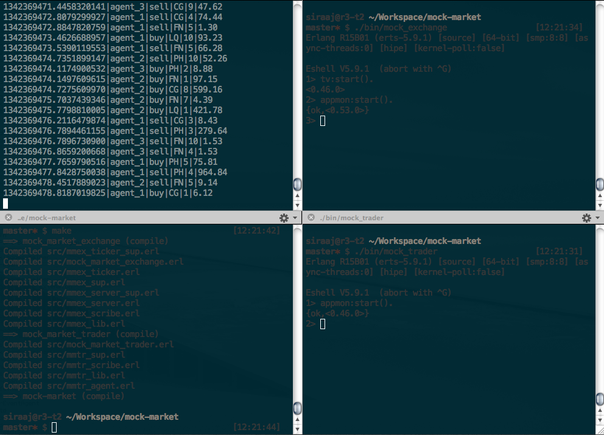
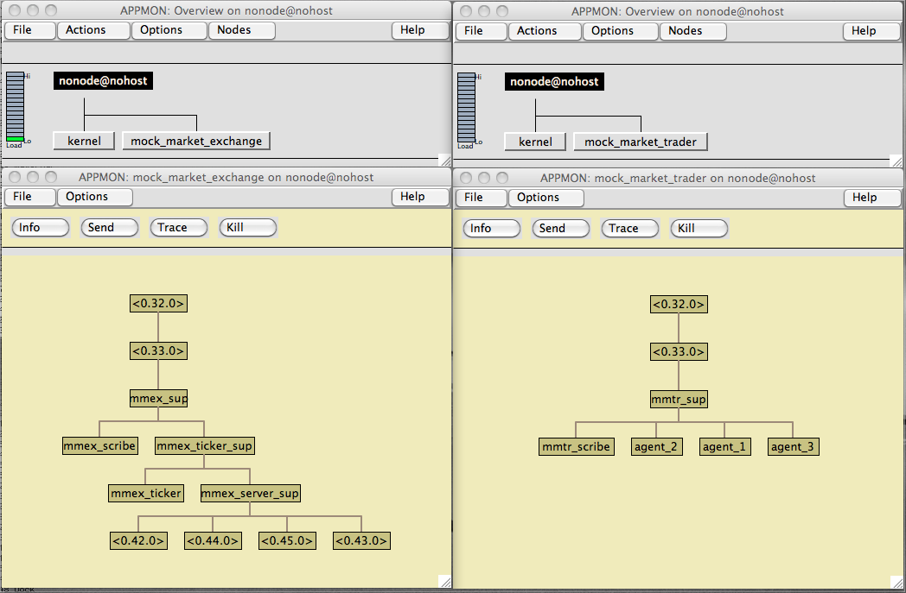

Mock Market
===========


Description
-----------

A simple market sim. The main point is to build a playground for me to
experiment with and learn about various concepts and technologies (OTP,
high-traffic servers, monitoring, various protocols and eventually crawling,
web mining, AI, NLP and ML). For now, just playing with an infrastructure,
while all events are random, eventually "mock_market_exchange" will facilitate
trading competition between competing trading agents. Once protocol is
designed, any implementation should be able join the trading competition.


Road Map
--------
* More elaborate communication protocol
* Actual trading between agents with finite amounts of starting capital
* Mock Bank app to store and manipulate capital information
* More elaborate data logging
* Data visualisation
* Secure communication channel(s) (SSH, SSL)
* RESTful interface
* Agents choose between available com channels (TCP binary, SSH binary, HTTPS)
* Smarter trading choices
* Front-end web interfaces


Usage
-----

See `apps/*/src/*_config.hrl` for configurable values.

Compile:

```sh
make
```

Start Exchange:

```sh
$ ./bin/mock_exchange
```

Start Trader:

```sh
$ ./bin/mock_exchange
```

Watch trade log:

```sh
$ tail -f ./data/transactions.dat
```


Examples
--------



